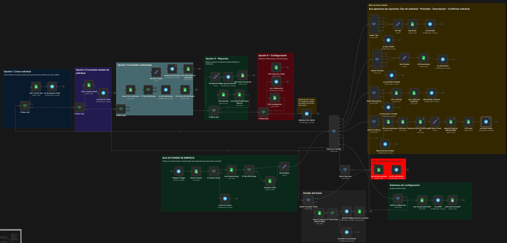

# HelpDeskBot 

## Descripción

HelpDeskBot es un bot conversacional desarrollado en **Telegram** usando **n8n Community Edition 2.17.3** y **Google Sheets** como persistencia de datos.

Su objetivo es gestionar solicitudes internas de soporte mediante flujos conversacionales controlados (wizard), automatizando el registro, consulta y seguimiento básico de tickets.

El bot **no utiliza IA ni aprendizaje automático**, sino lógica basada en estados, validaciones y automatizaciones en n8n.

---

# Tecnologías utilizadas

* n8n Community Edition 2.17.3
* Telegram Bot API
* Google Sheets
* JSON Workflow (n8n)

---

# Arquitectura General

Usuario (Telegram)
↓
Telegram Trigger
↓
Router por Pantalla (máquina de estados)
↓
Flujos Conversacionales
↓
Google Sheets (Persistencia)
↓
Respuestas automáticas en Telegram

---

# Modelo de Datos (Google Sheets)

## Documento

**HelpDeskBot_DB**

## Hoja USUARIOS

Campos:

* telegram_user
* nombre
* rol
* activo

Funciones:

* Validación de usuario activo
* Consulta de perfil en configuración

---

## Hoja LOGS

Campos:

* timestamp
* telegram_user
* pantalla
* opcion
* resultado
* tipo_temp
* prioridad_temp
* descripcion_temp

Funciones:

* Control de estado conversacional
* Navegación por pantallas
* Variables temporales del wizard
* Auditoría básica

Pantallas usadas:

* menu
* tipo
* prioridad
* descripcion
* confirmar
* configuracion
* consultar_ticket
* mis_solicitudes
* reportes

---

## Hoja SOLICITUDES

Campos:

* id_ticket
* tipo
* prioridad
* descripcion
* estado
* creado_por
* fecha_creacion

Estados:

* Abierto
* En proceso
* Cerrado

---

# Funcionalidades Implementadas

## 1. Crear Solicitud

Flujo guiado de 4 pasos:

1. Selección de tipo

* Soporte técnico
* Solicitud administrativa
* Consulta general

2. Prioridad

* Alta
* Media
* Baja

3. Descripción del problema

4. Confirmación y creación de ticket

Generación de ticket:

* ID único basado en timestamp
* Registro automático en SOLICITUDES
* Notificación de éxito en Telegram

Ejemplo:
HD-1714328815123

---

## 2. Consultar estado de solicitud

Permite ingresar un ID de ticket:

Ejemplo:
HD-001

Devuelve:

* Tipo
* Estado
* Prioridad
* Fecha

---

## 3. Mis solicitudes

Consulta automática de las últimas solicitudes del usuario autenticado.

Muestra:

* Últimos tickets
* Estado actual

Ejemplo:
HD-003 | Abierto
HD-002 | Cerrado
HD-001 | En proceso

---

## 4. Reportes

Reporte básico personal:

* Total tickets
* Abiertos
* Cerrados
* Alta prioridad

---

## 5. Configuración

Perfil de usuario:

* Nombre
* Rol
* Estado de cuenta

Incluye retorno controlado al menú principal.

---

# Validaciones implementadas

* Usuario activo obligatorio
* Campos obligatorios
* Prioridades válidas
* Confirmación antes de guardar
* Cancelación con opción 9
* Manejo de menús inválidos
* Prevención de duplicados en tickets

---

# Automatizaciones

## Registro automático de tickets

Al confirmar una solicitud:

* genera id_ticket
* guarda ticket en SOLICITUDES
* actualiza LOGS
* notifica en Telegram

## Máquina de estados conversacional

Controlada por:

* Switch por Pantalla
* Switch Tipo
* Switch Prioridad
* Switch Confirmar
* Switch Configuración

---

# Estructura del Workflow (nodos principales)

## Acceso

* Telegram Trigger
* Buscar Usuario
* IF Usuario Activo

## Estado

* Leer Estado Actual
* Inicializar LOGS
* Set Variables
* Switch por Pantalla

## Wizard Solicitudes

* Switch Tipo
* Switch Prioridad
* Switch Descripción
* Switch Confirmar
* Set Datos Ticket
* Append Ticket en SOLICITUDES

## Consultas

* Buscar Mis Solicitudes
* Consultar Ticket por ID
* Reportes

## Configuración

* IF Menu Op5
* LOG pantalla = configuracion
* Switch Configuración
* LOG menu tras config

---

# Consideraciones técnicas

## Prevención de duplicados

Se reemplazó generación secuencial por ID único basado en timestamp para evitar colisiones.

Antes:
HD-001, HD-002...

Ahora:
HD-1714328815123

---

## Compatibilidad

Probado para:

* n8n Community 2.17.3
* Google Sheets Node v4.7
* Telegram Node v1.2

---

# Uso

1. Iniciar conversación en Telegram.
2. Escribir una opción del menú.
3. Seguir el flujo guiado.
4. Confirmar o cancelar con 9.

Menú:

0. Ayuda
1. Crear solicitud
2. Consultar estado de solicitud
3. Mis solicitudes
4. Reportes
5. Configuración

---

# Limitaciones

* Persistencia basada en Google Sheets
* No incluye autenticación avanzada
* No incorpora IA ni clasificación automática
* Reportes básicos

---

# Autor

Proyecto académico desarrollado para automatización de mesa de ayuda con n8n.

---

# Licencia

Uso académico / educativo.
